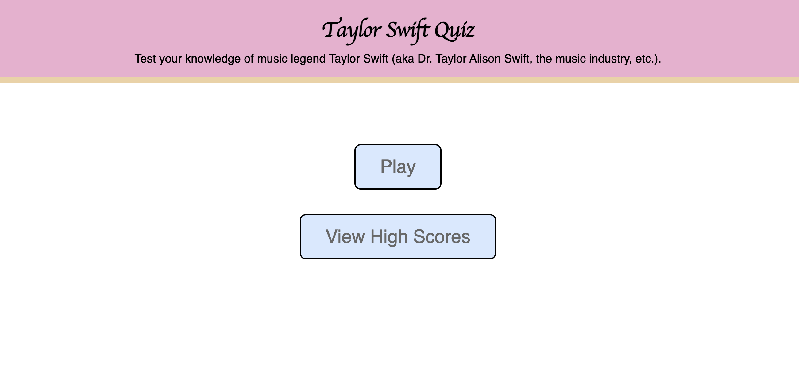
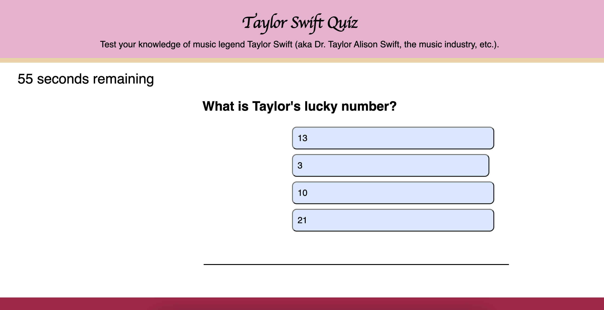
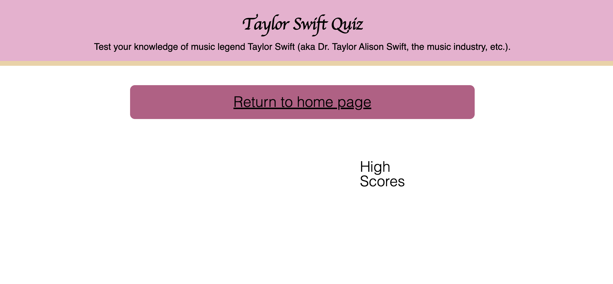

# Taylor-Swift-Quiz

## Description
I've created a short quiz on Taylor Swift that will test your knowledge of her music and life. The quiz is set on a 60-second timer. Wrong answers will get 10 seconds subtracted from the time. 

Link to live page: https://lkrum.github.io/Taylor-Swift-Quiz/

## Installation
N/A

## Usage
Click the "Play" button in the home.html file. Click on the answer choice you think is correct. If the timer runs out, the game will end and you will be taken to the high score page, where you have the option to play again.

## Credits 

- [W3schools](https://www.w3schools.com/jsref/met_loc_assign.asp
- [W3schools]https://www.w3schools.com/jsref/event_target.asp)
- [W3schools](https://www.w3schools.com/tags/tag_input.asp)
- [W3schools](https://www.w3schools.com/tags/tag_button.asp)
- Diem, one of the class TAs, helped me format my questions array
- Negin, one of the class TAs, helped me troubleshoot my functions and center my question and answer button text.
- A friend Chris Bartal helped me formulate my for loops and functions for my buttons to work. 
- Faran Navazi, one of the official bootcamp tutors, helped me make my code more concise.
- Will Lord helped me troubleshoot why my last question button wasn't working and he finally got it to work by moving it to the start of the checkAnswer function

## License
MIT License
